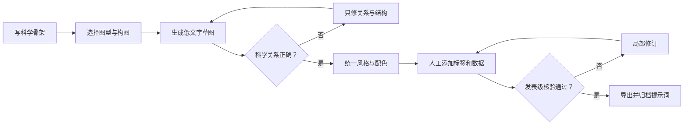

# 高质量科研图片提示词工程指南

> 从科学概念到发表级视觉草图：一套可复用、可检查、可迭代的科研图像生成方法。1


---

## 目录

- [1. 使用范围与科研诚信](#1-使用范围与科研诚信)
- [2. 一分钟快速开始](#2-一分钟快速开始)
- [3. 高质量提示词的核心结构](#3-高质量提示词的核心结构)
- [4. 通用母版：中文与英文](#4-通用母版中文与英文)
- [5. 按科研图片类型套用模板](#5-按科研图片类型套用模板)
- [6. 跨学科完整示例](#6-跨学科完整示例)
- [7. 风格、构图与配色词库](#7-风格构图与配色词库)
- [8. 负面提示词与常见失败修复](#8-负面提示词与常见失败修复)
- [9. 多轮迭代工作流](#9-多轮迭代工作流)
- [10. 发表级后处理与导出](#10-发表级后处理与导出)
- [11. 质量评分表](#11-质量评分表)
- [12. 速查卡](#12-速查卡)
- [13. 项目记录模板](#13-项目记录模板)
- [14. 贡献与许可建议](#14-贡献与许可建议)

---

## 1. 使用范围与科研诚信

本指南主要面向以下视觉任务：

- 机制示意图、信号通路图、实验流程图；
- 图形摘要（graphical abstract）与概念封面草图；
- 器件结构、材料分层、反应过程和生态过程示意图；
- 教学插图、科普视觉和论文配图的早期构思；
- 供设计师或科研人员继续矢量化的底图。

> [!IMPORTANT]
> 生成式图像适合制作“示意性视觉”，不应被伪装成真实实验观测、原始数据或临床证据。显微图、凝胶图、医学影像、谱图、统计图和定量热图必须来源于真实数据与合规分析。

### 必须人工核验的内容

1. **科学关系**：激活、抑制、转运、结合、因果与相关关系是否正确。
2. **结构细节**：分子、细胞器、组织、器件、地层和仪器连接是否合理。
3. **空间与尺度**：宏观、细胞、亚细胞、分子层级是否被错误混合。
4. **文字与符号**：基因/蛋白命名、单位、上下标、希腊字母、箭头方向是否准确。
5. **合规性**：目标期刊、机构和资助方是否要求披露 AI 辅助创作。
6. **可追溯性**：保留提示词、模型版本、日期、生成参数和人工修改记录。

### 推荐的图注表述

如需披露，可根据实际流程改写：

> 本图的初始视觉草图由生成式人工智能辅助创建，随后由作者依据研究内容进行科学核验、重绘与标注。图中不包含由人工智能生成或修改的实验数据。

---

## 2. 一分钟快速开始

把下面六行填完整，通常就能得到一个可用的第一版：

```text
图像类型：一张用于[论文/汇报/图形摘要]的[机制图/流程图/结构示意图]
科学主题：[研究对象]通过[关键过程]影响[结果]
核心元素：[元素A]、[元素B]、[元素C]、[环境或组织背景]
关系与顺序：A → B；B 抑制 C；C 最终导致 D
视觉设计：[横向/纵向/环形]构图，[扁平矢量/精细科学插画]风格，[配色]
约束：白色背景、留白充足、无装饰性文字、无水印、结构准确、便于后期标注
```

### 最短可用公式

$$
\text{高质量提示词}=
\text{科学事实}+
\text{视觉层级}+
\text{空间关系}+
\text{风格约束}+
\text{输出规范}+
\text{排除项}
$$

**一句话模板：**

```text
创建一张[用途]的[图片类型]，清晰展示[主体]在[场景]中通过[过程]导致[结果]；
采用[构图]与[风格]，以[主色]区分[功能分组]，突出[最重要信息]；
要求科学结构可信、层级清楚、留白充足、背景简洁，并排除[常见错误]。
```

---

## 3. 高质量提示词的核心结构

提示词不是形容词堆砌，而是一份“小型视觉设计说明书”。推荐按以下顺序组织：

| 层级 | 要回答的问题 | 示例 |
|---|---|---|
| ① 用途 | 图用在哪里？ | 期刊图形摘要、基金答辩、课程讲义 |
| ② 图型 | 要生成哪类图？ | 机制图、流程图、剖面图、装置图 |
| ③ 主命题 | 读者看完应记住什么？ | 缺氧通过 HIF-1α 重塑肿瘤代谢 |
| ④ 元素 | 必须出现什么？ | 肿瘤细胞、线粒体、葡萄糖、乳酸 |
| ⑤ 关系 | 元素如何互动？ | 激活、抑制、转运、扩散、转化 |
| ⑥ 层级 | 信息先后如何分组？ | 输入 → 机制 → 输出；宏观 → 微观 |
| ⑦ 构图 | 元素放在哪里？ | 左因右果、中心辐射、上下分层 |
| ⑧ 编码 | 颜色与形状代表什么？ | 蓝色=正常，红色=病理；虚线=间接作用 |
| ⑨ 风格 | 画面使用何种视觉语言？ | 扁平矢量、半写实医学插画、等距视图 |
| ⑩ 标注 | 文字如何处理？ | 预留标签位；只保留编号；不生成长文本 |
| ⑪ 输出 | 尺寸与背景是什么？ | 16:9、白底、高清、可裁切 |
| ⑫ 排除 | 哪些错误绝不能出现？ | 无伪文字、无错误分子结构、无多余箭头 |

### 3.1 先写“科学骨架”

在写审美词之前，先用最朴素的句子列出事实：

```text
条件：低氧环境
主体：肿瘤细胞
过程：HIF-1α 稳定 → 糖酵解相关基因表达上调
物质变化：葡萄糖摄取增加、乳酸生成增加
结果：酸性微环境、侵袭性增强
```

如果这一段不准确，再精美的图片也没有科研价值。

### 3.2 把关系写成“可画的动作”

抽象词往往难以稳定成图，应尽量转成可见动作：

| 抽象表达 | 更可画的表达 |
|---|---|
| “促进代谢” | 葡萄糖进入细胞增多，糖酵解通量箭头加粗 |
| “免疫抑制” | T 细胞活性降低，以灰化细胞和抑制符号表示 |
| “界面增强” | 两种材料接触面增大，界面处电荷密度提高 |
| “模型性能提升” | 数据流经过新模块后输出更准确，错误分支减少 |
| “污染物迁移” | 污染羽流沿地下水方向扩散并逐渐稀释 |

### 3.3 一张图只保留一个主命题

推荐的信息优先级：

- **一级信息**：不看文字也能理解的主因果链；
- **二级信息**：关键组成、空间位置和分支机制；
- **三级信息**：数值、条件、缩写与补充说明，交给后期标注。

当所有元素都被“强调”时，画面实际上没有重点。

---

## 4. 通用母版：中文与英文

### 4.1 中文母版

复制后替换方括号内容：

```text
任务：创建一张用于[目标场景]的高质量[科研图片类型]。

科学命题：清晰表达“[研究对象]在[条件/环境]下，通过[核心机制]引起[关键结果]”。

必要元素：
1. [元素A：外观、位置、状态]
2. [元素B：外观、位置、状态]
3. [元素C：外观、位置、状态]
4. [必要的背景、组织、材料或装置]

关系与流程：
- [A]通过[激活/抑制/结合/转运/扩散/转化]作用于[B]
- [B]随后导致[C]
- 使用[实线箭头/抑制线/虚线/渐变轨迹]准确区分关系

构图：采用[左→右/上→下/中心辐射/环形/多面板]结构；
[主体]位于[位置]；[输入]位于[位置]；[输出]位于[位置]；
通过尺寸、明暗和留白形成清晰的第一、第二、第三视觉层级。

视觉风格：[简洁扁平矢量/精细科学插画/半写实医学插画/等距技术示意图]；
线条统一，边缘清晰，材质克制，避免海报感和夸张艺术化。

配色：[主色]表示[含义]，[强调色]表示[含义]，[中性色]表示背景；
确保色盲友好、对比清楚、灰度打印仍可区分。

标注策略：不生成段落文字；为标题、图例和标签预留整齐空位；
如必须显示文本，仅显示[短标签列表]，拼写必须准确。

输出规范：[宽高比]，[白色/透明/浅色]背景，高分辨率，适合后期矢量重绘与排版。

严格排除：伪文字、水印、logo、无意义装饰、多余箭头、错误连接、重复结构、
比例混乱、过度发光、强烈景深、低清晰度、锯齿边缘、拥挤布局。
```

### 4.2 英文母版

许多图像模型对英文视觉术语的响应较稳定。即使科学内容用中文构思，也可以将最终提示词整理为英文：

```text
Create a publication-quality [type of scientific figure] for [target use].

Scientific message:
Clearly communicate that [subject], under [condition], undergoes [core mechanism],
leading to [key outcome].

Required visual elements:
1. [Element A: appearance, location, and state]
2. [Element B: appearance, location, and state]
3. [Element C: appearance, location, and state]
4. [Essential tissue, environment, material, or apparatus]

Relationships and sequence:
- [A] [activates / inhibits / binds to / transports / diffuses into / converts into] [B]
- [B] subsequently leads to [C]
- Use [solid arrows / blunt inhibition lines / dashed paths / gradients] consistently
  to distinguish direct, inhibitory, indirect, and directional relationships.

Composition:
Use a [left-to-right / top-to-bottom / radial / circular / multi-panel] layout.
Place [subject] at [position], [input] at [position], and [outcome] at [position].
Establish a strong primary, secondary, and tertiary visual hierarchy through scale,
contrast, alignment, and negative space.

Visual style:
[clean flat vector / precise scientific illustration / semi-realistic medical illustration /
isometric technical schematic], with consistent line weight, crisp edges, restrained
textures, and a professional academic appearance.

Color system:
Use [primary color] for [meaning], [accent color] for [meaning], and neutral tones for
context. Use a color-blind-friendly palette with sufficient grayscale contrast.

Label strategy:
Do not render paragraphs. Reserve clean label zones for later typesetting.
If text is unavoidable, include only these short labels: [label list].

Output:
[aspect ratio], [white / transparent / light neutral] background, high resolution,
clean margins, suitable for vector tracing and journal layout.

Avoid:
gibberish text, watermarks, logos, decorative clutter, redundant arrows, incorrect
connections, duplicated structures, inconsistent scale, excessive glow, dramatic
depth of field, jagged edges, low resolution, and crowded composition.
```

### 4.3 JSON 式结构母版

当模型容易遗漏要求时，可以用结构化提示词：

```json
{
  "purpose": "期刊图形摘要",
  "figure_type": "机制示意图",
  "scientific_claim": "[一句话主命题]",
  "required_elements": ["A", "B", "C"],
  "relationships": [
    {"source": "A", "action": "activates", "target": "B"},
    {"source": "B", "action": "inhibits", "target": "C"}
  ],
  "layout": "left-to-right",
  "visual_hierarchy": ["主机制", "辅助环境", "后期标签"],
  "style": "clean flat vector scientific illustration",
  "palette": {
    "normal": "#3B82F6",
    "pathological": "#D55E00",
    "context": "#D1D5DB"
  },
  "background": "white",
  "text_policy": "reserve blank label zones",
  "avoid": ["gibberish text", "watermark", "extra arrows", "visual clutter"]
}
```

> [!TIP]
> 结构化提示词的价值在于减少遗漏，并不意味着必须显示 JSON 本身。可以把它当作内容检查表，再改写成自然语言。

---

## 5. 按科研图片类型套用模板

### 5.1 机制与信号通路图

```text
创建一张发表级生物医学机制示意图。画面按“胞外 → 细胞膜 → 胞质 → 细胞核”
分层，展示[配体]与[受体]结合，依次激活[蛋白A]和[蛋白B]，随后[转录因子]
进入细胞核并上调[靶基因]，最终导致[表型]。直接激活使用实线箭头，抑制使用
T形端点，间接作用使用虚线。突出主通路，弱化辅助分支。采用简洁矢量科学插画，
白色背景，蓝—橙色盲友好配色，统一线宽，预留标签位。无伪文字、无多余细胞器、
无错误连接、无重复蛋白、无装饰性光效。
```

### 5.2 实验流程与研究设计图

```text
创建一张横向五阶段实验工作流程图：样本采集 → 预处理 → 实验/测量 → 数据分析
→ 结果验证。每一阶段使用一个清晰图标和独立色块，阶段之间以统一箭头连接；
在每个阶段下方预留两行短注释空间。风格为简洁扁平矢量，等宽卡片，严格对齐，
白色背景，深蓝主色与青绿色强调色。避免人物卡通化、伪文字、3D 阴影、步骤重复、
箭头交叉和信息拥挤。16:9 横向构图，适合学术汇报与论文方法概览。
```

### 5.3 材料结构与器件剖面图

```text
创建一张精确的材料器件剖面示意图，从下至上展示[基底]、[功能层A]、[界面层]、
[功能层B]和[电极]。各层厚度仅表达相对关系，不暗示真实比例；用干净的截面纹理
区分材料，并以箭头展示[电子/离子/热量]的传输方向。右侧加入局部放大窗口，展示
[关键界面机制]。采用等距技术插画与矢量线稿结合的风格，背景纯白，结构边界清晰，
配色克制，标签位置对齐。避免错误晶格、悬浮层、断裂连接、夸张金属反光和透视畸变。
```

### 5.4 医学与解剖示意图

```text
创建一张用于医学教育的半写实解剖示意图，展示[器官/组织]的[观察方向]与
[关键病理变化]。正常区域和病变区域并列对照，保留可信的解剖比例与组织层次；
用克制的颜色和局部放大框突出[结构]，避免血腥化、戏剧化和摄影级手术场景。
背景为浅中性色，照明均匀，边缘清晰，为规范医学标注预留空间。不得虚构病灶位置、
血管连接或器官结构；图片仅作示意，不呈现为真实患者影像。
```

### 5.5 生态、环境与地学过程图

```text
创建一张横向生态过程剖面图，从[源区]经过[传输路径]到达[汇区]，同时展示大气、
地表、土壤/沉积物和地下水四个层级。[污染物/碳/水分]的迁移使用方向箭头，
浓度或强度使用单调渐变表达；生物作用与物理过程使用不同线型。风格为清晰的科学
信息图，不追求风景画效果。保持地层连续、流向合理、比例层级明确，预留图例与标尺
位置。排除不合理河流走向、重复物种、装饰性云朵、过饱和颜色和伪标签。
```

### 5.6 算法、模型与数据管线图

```text
创建一张严谨的机器学习模型架构图：输入数据位于左侧，依次经过[编码器]、
[核心模块]、[融合模块]和[预测头]，输出位于右侧；训练阶段的损失函数从下方以
虚线连接相关模块。不同数据模态使用不同颜色，但模块形状保持统一。采用平面矢量、
网格对齐、正交连线和简洁卡片式设计，背景纯白，预留模块名称位置。无伪代码、
无虚假性能数字、无交叉箭头、无立体芯片装饰、无霓虹科技风。
```

### 5.7 化学反应概念图

```text
创建一张化学反应机制的概念性视觉草图，按左到右展示反应物、关键中间态、催化环境
和产物。准确表达[催化剂]提供的反应界面、[电子/质子]转移方向和主要选择性路径；
竞争路径以弱化虚线表示。采用克制的科学矢量风格，分子图形只作视觉占位，正式结构式
将在后期用专业化学绘图软件重绘。禁止生成看似精确但化学价态错误的结构式、错误键型、
伪元素符号或未经数据支持的能垒数值。
```

### 5.8 多面板图形摘要

```text
创建一张三面板图形摘要，整体为横向布局：
A 面板“研究问题”：展示[背景与挑战]；
B 面板“核心方法”：展示[材料/实验/算法]；
C 面板“关键结果与意义”：展示[结果]如何带来[应用价值]。
三个面板具有统一视角、线宽和配色，通过微妙的连续箭头连接；B 面板视觉权重最高。
顶部预留标题区，底部预留一句结论区。白色背景、期刊级扁平矢量风格、边距充足。
不生成长段文字，不捏造数据，不使用奖章、灯泡、握手等陈词滥调图标。
```

### 5.9 期刊封面概念草图

```text
创建一张科学期刊封面概念插画，以[核心科学对象]为视觉中心，通过[象征性但科学可解释
的场景]表现[研究突破]。画面具有清晰焦点、纵深和高质量材质，但保留学术克制；
将微观结构与宏观场景通过连续形态自然连接。顶部与四周保留刊名、标题和裁切安全区。
竖版构图，强调[主色]与[点缀色]。避免商业海报文字、logo、水印、无意义粒子、
过度赛博朋克、过量镜头光晕以及会被误认为真实实验结果的细节。
```

---

## 6. 跨学科完整示例

以下示例展示“科学骨架 → 成品提示词”的转换方式。请先验证科学内容，再替换成自己的研究对象。

### 6.1 肿瘤免疫微环境机制图

**科学骨架：**肿瘤细胞释放信号；巨噬细胞向免疫抑制表型偏移；T 细胞功能受抑；肿瘤逃逸增强。

```text
Create a publication-quality biomedical mechanism diagram of tumor immune evasion.
Use a left-to-right narrative inside a simplified tumor microenvironment. On the left,
show tumor cells releasing signaling molecules toward a macrophage in the center.
Show the macrophage shifting from an inflammatory state to an immunosuppressive state.
On the right, show reduced cytotoxic T-cell activity and increased tumor survival.

Use solid arrows for direct signaling, a blunt-ended line for inhibition of T-cell activity,
and a subtle dashed arrow for indirect effects. Make the macrophage transition the primary
visual focus. Use a clean flat-vector scientific illustration, white background, consistent
line weight, restrained blue–orange palette, and ample label zones. Maintain plausible cell
morphology without excessive organelle detail. No embedded paragraphs, gibberish labels,
extra immune-cell types, decorative particles, watermarks, or dramatic 3D lighting.
```

**后期核验：**补充具体配体、受体和细胞因子；确认“极化”用词是否符合领域共识；不要仅凭颜色暗示细胞功能。

### 6.2 锂电池界面失效图

**科学骨架：**循环过程中界面层演化；离子传输受阻；枝晶/副反应累积；容量衰减。

```text
Create a precise cross-sectional scientific schematic of interfacial degradation in a
rechargeable battery during cycling. Arrange two matched panels: an early-cycle interface
on the left and an aged interface on the right. Show the electrode, interphase, electrolyte,
and separator as clearly separated layers. Use directional paths to depict ion transport;
show a thin, relatively uniform interphase in the early state and a thicker, heterogeneous
interphase with blocked transport pathways in the aged state. Indicate localized side
reactions and irregular deposition conceptually, without inventing atomic structures.

Use an isometric technical illustration with crisp vector edges, white background, muted
blue-gray materials, and orange accents for degradation. Keep identical scale and viewpoint
between panels. Reserve space beneath both panels for labels and measured values to be added
later. Avoid floating layers, impossible interfaces, random crystal lattices, excessive
metallic reflections, flames, text artifacts, and unsupported quantitative claims.
```

**后期核验：**界面层命名、载流离子方向、充放电状态与电极正负极必须相互一致。

### 6.3 地下水污染迁移图

**科学骨架：**地表污染源下渗；随地下水迁移；在下游形成污染羽；监测井提供观测。

```text
Create a clear environmental-science cross-section showing contaminant transport from a
surface source into groundwater. Show four continuous layers: ground surface, unsaturated
soil, the water table, and a permeable aquifer above a confining layer. Place the source on
the upper left. Depict downward infiltration through the vadose zone, followed by a plume
moving with groundwater from left to right. Use a monotonic concentration gradient that
fades with distance. Include three monitoring wells at upstream, near-source, and downstream
positions, with consistent depth and simple construction.

Use a clean scientific infographic style, orthographic side view, restrained earth-tone
context, and a color-blind-safe purple accent for the contaminant plume. Reserve blank areas
for a legend, scale bar, and hydrogeological labels. Do not create a scenic landscape,
misaligned strata, uphill groundwater flow, duplicated wells, random arrows, numerical
concentrations, or illegible text.
```

**后期核验：**水力坡度、井筛位置、隔水层连续性和污染源类型应与研究区资料一致。

### 6.4 多模态深度学习架构图

**科学骨架：**影像与表格数据分别编码；特征融合；预测；损失函数监督。

```text
Create a publication-ready architecture diagram for a multimodal prediction model. Use a
strict left-to-right data flow. At the left, place two aligned input lanes: medical images
in the upper lane and tabular clinical variables in the lower lane. Route them separately
through an image encoder and a tabular encoder. Merge both streams in a central fusion
module, then pass the fused representation through a prediction head to a single output.
Show training losses below the main pipeline using thin dashed connectors only.

Use flat vector graphics, orthogonal connectors, a consistent card system, uniform corner
radii, and generous spacing. Encode modalities with blue and green; use dark navy for the
fusion module and neutral gray for training-only elements. White background, 16:9 aspect
ratio, clean label zones. Do not include pseudo-code, invented layer counts, fake metrics,
3D chips, neon effects, crossing arrows, or decorative AI-brain imagery.
```

**后期核验：**训练与推理阶段的连线应区分；不要让图暗示未实现的模块或数据流。

### 6.5 单细胞研究流程图

**科学骨架：**组织取样 → 单细胞悬液 → 测序 → 质控与聚类 → 细胞注释 → 生物学验证。

```text
Create a six-step horizontal workflow for a single-cell study: tissue sampling, preparation
of a single-cell suspension, library preparation and sequencing, quality control and
clustering, cell-type annotation, and biological validation. Represent each step with one
scientifically recognizable but simplified icon. Connect all steps with a single consistent
arrow system. Give the computational-analysis stages a subtle shared background band to
distinguish them from wet-lab stages.

Use a clean flat-vector academic infographic, white background, equal-width step cards,
precise grid alignment, and a color-blind-friendly blue, teal, and orange palette. Leave
two short label lines beneath each icon. No readable gene lists, no invented UMAP clusters,
no fake numerical results, no pipette-hand errors, no duplicated steps, no cartoon faces,
and no 3D glossy styling.
```

**后期核验：**真实流程可能包含批次校正、双细胞过滤等步骤，应按研究方案调整；示意 UMAP 不得冒充真实分析结果。

---

## 7. 风格、构图与配色词库

### 7.1 风格词：按目标选择，不要全部堆叠

| 目标 | 推荐词汇 | 谨慎使用 |
|---|---|---|
| 论文机制图 | clean flat vector, scientific schematic, consistent line weight | cinematic, fantasy, dramatic |
| 医学教学图 | anatomically plausible, semi-realistic, evenly lit | photorealistic surgery, gore |
| 器件结构图 | isometric technical illustration, cutaway view, crisp edges | exploded view（除非确实需要） |
| 图形摘要 | editorial scientific infographic, strong hierarchy | poster typography, advertising |
| 封面草图 | conceptual scientific illustration, controlled depth | excessive glow, cyberpunk |
| 流程图 | grid-aligned, orthogonal connectors, modular cards | hand-drawn arrows, 3D icons |

### 7.2 构图词库

| 逻辑 | 构图建议 | 适用场景 |
|---|---|---|
| 原因 → 机制 → 结果 | 左到右三段式 | 图形摘要、机制链 |
| 宏观 → 微观 | 主场景 + 局部放大框 | 材料、组织、生态 |
| 输入 → 处理 → 输出 | 流水线式 | 实验流程、算法架构 |
| 中心对象 → 多种影响 | 中心辐射式 | 综述、关键因子网络 |
| 阶段性变化 | 时间轴或并列对照 | 发育、老化、循环 |
| 正常 vs 病理 | 镜像双面板 | 医学、细胞表型 |
| 多尺度耦合 | 嵌套窗口 | 原子—器件、细胞—组织 |

### 7.3 推荐配色

配色应承担“编码”功能，而不只是装饰。

| 名称 | 色值 | 推荐语义 |
|---|---|---|
| 深蓝 | `#1F4E79` | 主结构、稳定、基线 |
| 天蓝 | `#56B4E9` | 正常状态、水相、输入 |
| 蓝绿 | `#009E73` | 有益过程、恢复、验证 |
| 橙色 | `#E69F00` | 激活、能量、重点 |
| 朱红 | `#D55E00` | 病理、损伤、警示 |
| 紫红 | `#CC79A7` | 特殊分支、辅助通路 |
| 中灰 | `#9CA3AF` | 背景、非活跃结构 |
| 深灰 | `#374151` | 文字、轮廓、箭头 |

推荐组合：

- **正常 / 病理**：`#56B4E9` / `#D55E00`
- **输入 / 机制 / 输出**：`#56B4E9` / `#009E73` / `#E69F00`
- **主体 / 环境 / 强调**：`#1F4E79` / `#D1D5DB` / `#CC79A7`

> [!NOTE]
> 不要只用红色和绿色区分类别。除了颜色，还应结合形状、线型、纹理或文字标签提供冗余编码。

### 7.4 箭头与线型语法

| 图形语法 | 推荐含义 |
|---|---|
| 实线箭头 `→` | 直接作用、确定流程、物质传输 |
| T 形端点 `⊣` | 抑制、阻断 |
| 虚线箭头 `⇢` | 间接、推测、训练阶段或次要关系 |
| 双向箭头 `↔` | 可逆过程或双向交换 |
| 渐变带 | 连续变化、浓度或强度趋势 |
| 放大框连线 | 尺度切换，不代表因果 |

同一张图中，同一种线型必须保持同一种语义。

### 7.5 文字策略

图像生成模型常会产生拼写错误或伪文字。更稳妥的流程是：

1. 生成**无文字底图**或只带编号的底图；
2. 在矢量/排版软件中添加正式标签；
3. 统一字体、字号、大小写、斜体、上下标和单位；
4. 最后逐字校对，并与正文术语保持一致。

推荐在提示词中写：

```text
Reserve clean, aligned label zones. Do not render paragraphs or decorative typography.
Use numbered callouts only; all scientific labels will be typeset later.
```

---

## 8. 负面提示词与常见失败修复

### 8.1 通用负面提示词

```text
Avoid gibberish text, misspelled labels, watermarks, logos, decorative clutter,
incorrect arrows, duplicated objects, fused structures, impossible anatomy,
invented molecular structures, inconsistent perspective, misleading scale,
oversaturated colors, excessive glow, heavy shadows, dramatic depth of field,
low resolution, blurry edges, jagged lines, crowded layout, and unsupported data.
```

### 8.2 科研专项排除词

按需选择，不必全部加入：

```text
no fake microscopy texture
no fabricated measurement values
no invented error bars
no pseudo-chemical formulas
no impossible molecular bonds
no anatomically incorrect vessels
no extra organelles
no duplicated limbs or instruments
no misleading size comparison
no random crystal lattice
no decorative DNA helix
no generic AI brain icon
no crossed or ambiguous connectors
no rainbow color map
no photorealistic patient identity
```

### 8.3 失败现象 → 修复语句

| 失败现象 | 可能原因 | 可追加的修复语句 |
|---|---|---|
| 信息太拥挤 | 元素过多、无层级 | `Limit the figure to one main pathway and no more than two secondary branches.` |
| 箭头混乱 | 未指定语义与方向 | `Use one unidirectional flow; no crossing connectors; consistent arrow grammar.` |
| 文字乱码 | 要求模型生成长文本 | `Remove all text; reserve numbered callout zones for later typesetting.` |
| 太像宣传海报 | 使用了电影化词汇 | `Use restrained academic infographic styling, even lighting, and a white background.` |
| 画面无重点 | 每个元素权重相同 | `Make [X] the dominant focal point; render context at lower contrast and smaller scale.` |
| 生物结构不可信 | 只写了对象名称 | `Maintain plausible morphology and correct spatial compartmentalization.` |
| 材料层悬空 | 未明确层间关系 | `All layers must be continuous, flush, and physically connected with crisp interfaces.` |
| 多面板不一致 | 每个面板独立描述 | `Keep identical viewpoint, scale, lighting, line weight, and palette across panels.` |
| 颜色太杂 | 没有颜色语义 | `Use at most three chromatic hues plus neutral grays; one meaning per color.` |
| 图像像“伪数据” | 写了真实感和数值 | `Conceptual schematic only; do not imitate measured data or microscopy.` |

### 8.4 用“局部修改指令”替代整图重做

```text
Keep the overall composition, palette, and all validated scientific elements unchanged.
Only revise the following: [精确指出对象、位置、关系和目标状态].
Do not add new elements. Preserve empty label zones and existing panel alignment.
```

这个写法能减少“修一个问题，又引入三个新问题”的概率。

---

## 9. 多轮迭代工作流



### Round 0：写不可妥协项

```text
必须出现：[A、B、C]
必须正确：[A 与 B 的空间关系；B 抑制 C]
可以简化：[背景、非关键细胞器、次要支路]
绝不能出现：[错误连接、虚构数值、伪文字]
```

### Round 1：只求结构正确

先用灰度、少文字、简单图标。不要一开始就追求材质与“高级感”。

### Round 2：锁定构图

```text
Keep the validated scientific structure unchanged. Improve only alignment, spacing,
visual hierarchy, and panel balance. Do not add or remove scientific elements.
```

### Round 3：统一视觉系统

```text
Keep all content and geometry unchanged. Apply a consistent flat-vector scientific style,
uniform line weight, color-blind-friendly palette, and clean white background.
```

### Round 4：清理并预留标签

```text
Remove all unreliable text. Preserve numbered callouts and create aligned blank label zones.
Increase whitespace around arrows and key structures.
```

### Round 5：人工核验与矢量化

- 专业软件重绘分子结构、统计图、坐标轴和数据元素；
- 手工添加箭头、标签、图例、标尺、单位和面板编号；
- 检查彩图、灰度图和缩小预览三种状态；
- 由熟悉该领域的人进行科学复核。

---

## 10. 发表级后处理与导出

### 10.1 建议的后处理顺序

1. **裁切与布局**：先定最终宽高比和面板比例。
2. **结构纠错**：重绘箭头、边界、连接和关键形态。
3. **文字排版**：添加术语、单位、图例、面板编号。
4. **颜色校正**：确认颜色语义、对比度和色盲可读性。
5. **数据替换**：所有定量元素必须换成真实分析结果。
6. **输出检查**：按目标期刊或会议的最新规范导出。

### 10.2 分辨率计算

若目标印刷宽度为 $W$ 英寸、要求分辨率为 $R$ dpi，则所需像素宽度为：

$$
P = W \times R
$$

例如，最终宽度为 7 英寸、导出要求为 300 dpi：

$$
P = 7 \times 300 = 2100\ \text{px}
$$

> [!CAUTION]
> “把低分辨率图设置为 300 dpi”不会凭空增加真实细节。应从足够大的源图导出，或进行人工矢量重绘。

### 10.3 文件格式建议

| 格式 | 适合 | 注意事项 |
|---|---|---|
| SVG / PDF | 矢量线稿、流程图、文字较多的图 | 检查字体嵌入与透明效果 |
| TIFF | 期刊常见的高质量栅格交付 | 文件较大；按要求选择压缩方式 |
| PNG | 网页、幻灯片、透明背景 | 不适合反复有损编辑 |
| JPEG | 照片类预览 | 有损压缩，不适合线稿和小字 |

最终格式、色彩空间、线宽与分辨率应以**目标期刊当前作者指南**为准。

### 10.4 缩小测试

把图片缩小到论文栏宽或幻灯片缩略图大小，检查：

- 主结论是否仍能在 3 秒内被识别；
- 最细线条是否消失；
- 颜色类别是否仍能区分；
- 标签是否挤压或互相遮挡；
- 局部放大框是否仍有意义。

---

## 11. 质量评分表

生成后按 100 分自评。**科学准确性低于 30 分时，不建议继续美化，应先重做结构。**

| 维度 | 分值 | 检查问题 |
|---|---:|---|
| 科学准确性 | 35 | 对象、关系、方向、结构、尺度是否可信？是否含虚构证据？ |
| 信息层级 | 15 | 主命题是否突出？阅读顺序是否自然？ |
| 构图与留白 | 10 | 元素是否对齐？密度是否均衡？是否有标签空间？ |
| 视觉一致性 | 10 | 线宽、透视、图标、光照和面板是否统一？ |
| 颜色与可读性 | 10 | 颜色是否有语义？色盲和灰度状态是否可区分？ |
| 标注与符号 | 10 | 术语、字体、单位、箭头和图例是否统一？ |
| 输出规范 | 5 | 尺寸、分辨率、格式与背景是否符合用途？ |
| 可追溯与合规 | 5 | 是否保留提示词和版本？是否完成必要披露？ |

### 一票否决项

- 把 AI 生成内容冒充实验观测或真实数据；
- 分子结构、解剖结构或因果关系明显错误；
- 图中结论超出研究证据；
- 使用无法确认授权的 logo、商标或受保护素材；
- 关键文字无法辨认或标签指向错误对象。

---

## 12. 速查卡

### 12.1 十个高价值短语

```text
publication-quality scientific schematic
single dominant scientific message
clear primary, secondary, and tertiary hierarchy
consistent arrow grammar
anatomically / physically plausible structure
color-blind-friendly palette
restrained academic styling
ample negative space for labels
conceptual illustration, not measured data
suitable for vector tracing and later typesetting
```

### 12.2 十个常用排除项

```text
no gibberish text
no watermarks or logos
no fabricated numerical data
no redundant arrows
no duplicated structures
no inconsistent scale
no excessive glow
no decorative clutter
no crowded composition
no unsupported scientific details
```

### 12.3 提交生成前的 15 秒检查

- [ ] 用途与图型写清楚了吗？
- [ ] 主命题能否压缩为一句话？
- [ ] 必要元素是否逐项列出？
- [ ] 关系方向是否明确？
- [ ] 构图位置是否明确？
- [ ] 颜色是否有固定语义？
- [ ] 是否规定了文字策略？
- [ ] 是否写了绝不能出现的错误？
- [ ] 是否区分示意图与真实数据？

---

## 13. 项目记录模板

建议为每张科研图保存一份记录，以便复现、协作和披露。

````markdown
# 图像生成记录

## 基本信息

- 项目名称：
- 图号/用途：
- 创建日期：
- 负责人：
- 生成工具与版本：
- 宽高比/参数：

## 科学依据

- 一句话主命题：
- 必要元素：
- 关键关系：
- 参考文献或内部数据：
- 领域复核人：

## 提示词

### v1

```text
[粘贴提示词]
```

### v2 修改

- 修改原因：
- 保留内容：
- 修改内容：

```text
[粘贴修订提示词]
```

## 人工后处理

- [ ] 结构纠错
- [ ] 正式标签
- [ ] 真实数据替换
- [ ] 配色与可访问性检查
- [ ] 分辨率与格式检查

## 合规记录

- AI 使用披露要求：
- 实际披露文字：
- 授权与素材来源：
- 最终审核日期：
````

### 建议的版本命名

```text
project_figure-purpose_v01_structure.png
project_figure-purpose_v02_style.png
project_figure-purpose_v03_labels.svg
project_figure-purpose_v04_reviewed.pdf
```

不要用 `final_final_revised2.png`：它无法清晰表达版本含义。

---

## 14. 贡献与许可建议

如果将本指南作为 GitHub 项目发布，可以补充以下文件：

```text
README.md          # 项目首页，可直接使用本指南
LICENSE            # 明确开源许可
CONTRIBUTING.md     # 贡献规则与示例格式
CHANGELOG.md        # 版本更新记录
examples/           # 按学科分类的提示词案例
templates/          # 可复制的提示词母版
assets/             # 合法授权的示例图片
```

推荐的贡献条目格式：

```markdown
## 示例名称

- 学科：
- 图片类型：
- 目标用途：
- 科学命题：
- 提示词：
- 负面提示词：
- 人工核验要点：
- 生成工具与日期：
- 示例图片授权：
```

发布前请自行选择并添加合适的开源许可证。许可证应同时考虑：

- 本文档文字与模板的使用、修改和再分发；
- 示例图片是否拥有独立版权或模型输出限制；
- 外部贡献者是否同意按项目许可证提交内容；
- 第三方商标、图标、字体和素材是否具备授权。

---

## 结语

优质科研图片的目标不是“看起来复杂”，而是让正确的科学信息更快、更清楚、更诚实地被理解。

最可靠的实践顺序始终是：

> **先验证科学事实，再设计信息层级；先生成结构草图，再完成专业排版；最后以人工复核守住准确性。**

如果这份指南对你的研究或创作有帮助，欢迎在发布到 GitHub 后持续补充不同学科的真实案例、失败案例与修复策略。
